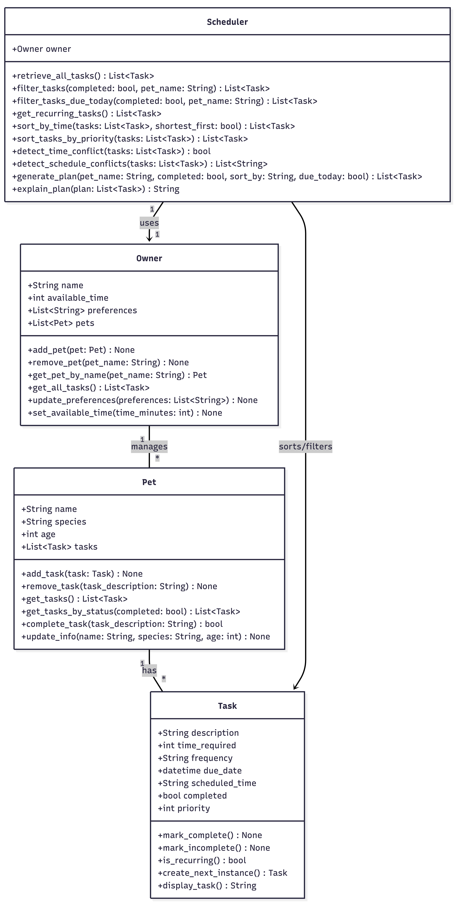
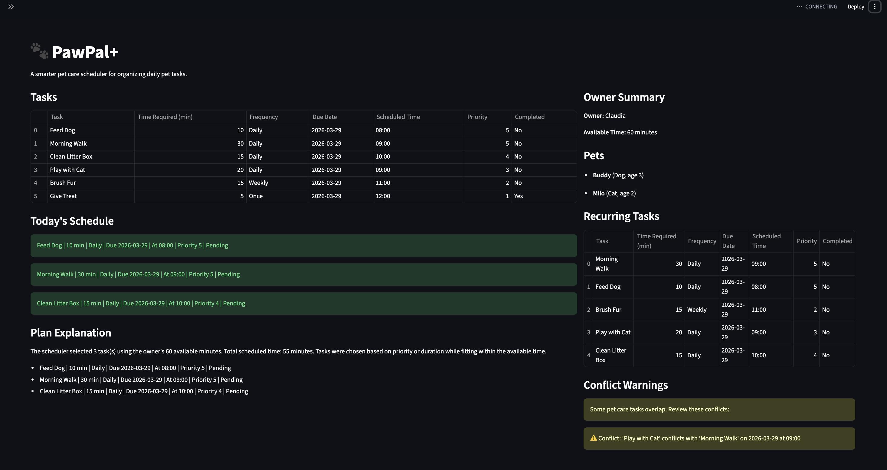

# PawPal+ (Module 2 Project)

You are building **PawPal+**, a Streamlit app that helps a pet owner plan care tasks for their pet.

## Scenario

A busy pet owner needs help staying consistent with pet care. They want an assistant that can:

- Track pet care tasks (walks, feeding, meds, enrichment, grooming, etc.)
- Consider constraints (time available, priority, owner preferences)
- Produce a daily plan and explain why it chose that plan

Your job is to design the system first (UML), then implement the logic in Python, then connect it to the Streamlit UI.

## What you will build

Your final app should:

- Let a user enter basic owner + pet info
- Let a user add/edit tasks (duration + priority at minimum)
- Generate a daily schedule/plan based on constraints and priorities
- Display the plan clearly (and ideally explain the reasoning)
- Include tests for the most important scheduling behaviors

## Getting started

### Setup

```bash
python -m venv .venv
source .venv/bin/activate  # Windows: .venv\Scripts\activate
pip install -r requirements.txt
```

### Suggested workflow

1. Read the scenario carefully and identify requirements and edge cases.
2. Draft a UML diagram (classes, attributes, methods, relationships).
3. Convert UML into Python class stubs (no logic yet).
4. Implement scheduling logic in small increments.
5. Add tests to verify key behaviors.
6. Connect your logic to the Streamlit UI in `app.py`.
7. Refine UML so it matches what you actually built.

## Smarter Scheduling

The PawPal+ scheduler includes several intelligent features to improve pet care planning:

- **Sorting Tasks**: Tasks can be sorted by priority or time required to optimize scheduling.
- **Filtering**: Tasks can be filtered by completion status and by specific pets.
- **Recurring Tasks**: Daily and weekly tasks automatically generate a new instance after completion.
- **Conflict Detection**: The system detects when multiple tasks are scheduled at the same time and provides warnings instead of failing.
- **Time Constraints**: The scheduler ensures that selected tasks fit within the owner's available time.

These features make the system more realistic and useful for managing daily pet care responsibilities.

## 🚀 Features

PawPal+ includes several intelligent scheduling features:

- **Priority-Based Scheduling**  
  Automatically selects the most important tasks first (e.g., feeding, medication).

- **Sorting by Time or Priority**  
  Tasks can be organized by shortest duration or highest priority.

- **Task Filtering**  
  Filter tasks by:
  - Pet name
  - Completion status (Pending / Completed)
  - Due date (Today only)

- **Recurring Tasks**  
  Daily and weekly tasks automatically generate a new instance after completion.

- **Conflict Detection**  
  Detects when multiple tasks are scheduled at the same time and displays warnings.

- **Time Constraint Handling**  
  Ensures the total scheduled tasks fit within the owner's available time.

- **Plan Explanation**  
  Provides a clear explanation of why tasks were selected.

  ## 🧩 System Architecture (UML)



  ## 📸 Demo


